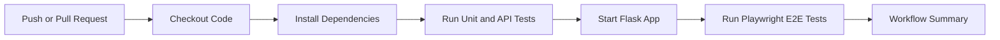

# Assignment 2: Test Automation Implementation
## GoodBooks

**Project:** GoodBooks Book Recommendation Platform  
**Repository:** `https://github.com/AslanAbishev/BookMagaz.git`  
**Branch used for this report:** `main`  
**Execution date:** `2026-04-04`  
**Primary evidence folder:** [`docs/evidence/`](../docs/evidence/)

## 1. Automation Summary

| Metric | Result |
|---|---|
| Automated non-E2E test cases | 68 |
| Passed | 68 |
| Failed | 0 |
| Skipped | 0 |
| Full non-E2E runtime | 2.51 sec |
| Sum of module runtimes | 12.962 sec |
| High-risk modules automated | 8/8 |
| High-risk automation coverage | 100% |

**Implementation notes**
- The test suite was strengthened from mostly status-code checks into deterministic branch-level tests.
- Mongo connection timeouts were shortened in the test environment so the suite behaves like a real CI quality gate instead of waiting for unreachable local services.
- Reusable in-memory test doubles were added in `tests/helpers.py` to keep route and model tests isolated from live infrastructure.

## 2. Scope Table

| Module/Feature | High-Risk Function | Test Priority | Notes / Expected Outcome |
|---|---|---|---|
| Authentication | Registration validation and account creation | High | Must reject invalid input and create users only for valid requests |
| Authentication | Login and session creation | High | Must reject invalid credentials and set session for valid credentials |
| Password Recovery | Forgot-password and reset-password flow | High | Must generate tokens, validate tokens, and update password safely |
| Search | `/api/search` text/category filtering | High | Must return JSON results and normalize blank filters |
| User Interactions API | `/api/interact`, `/api/rate`, `/api/like`, `/api/purchase` | High | Must require auth, validate input, and persist correct interaction types |
| Recommendations | `/api/recommend`, profile recommendations, similar books | High | Must return serialized recommendations and render recommendation data |
| Product/Profile Routes | `/product/<id>`, `/profile`, `/history` | High | Must redirect unauthenticated users and track first-time view interactions |
| Data Layer | User normalization, password reset helpers, interaction storage | High | Must normalize email, coerce field types, and clear reset fields correctly |

## 3. Test Cases Table

| Test Case ID | Module/Feature | Description | Input Data | Expected Result | Scenario Type | Notes |
|---|---|---|---|---|---|---|
| TC01 | Registration | Successful registration | Valid username, password, email, name | Redirect to `/login`; user creation called with hashed password | Positive | Covered in `test_register_success_redirects_to_login` |
| TC02 | Registration | Duplicate username | Existing username + new email | Form re-renders with duplicate username error | Negative | Prevents duplicate accounts |
| TC03 | Registration | Duplicate email | New username + existing email | Form re-renders with duplicate email error | Negative | Validates unique email requirement |
| TC04 | Registration | Short password | Password shorter than 6 chars | Validation error displayed | Negative | Protects weak credentials |
| TC05 | Login | Successful login | Valid username/password | Redirect to `/`; session stores `user_id` and `username` | Positive | Session creation verified directly |
| TC06 | Login | Invalid credentials | Unknown username or wrong password | Error rendered; no session created | Negative | Existing plus new assertions |
| TC07 | Forgot Password | Known email reset request | Registered email | Reset token persisted and link message shown | Positive | Token setter is asserted |
| TC08 | Reset Password | Mismatched passwords | Valid token + mismatch | Reset form re-renders with validation error | Negative | Prevents accidental reset |
| TC09 | Search API | Blank category normalization | `q=clean code`, `category='  '`, `limit=7` | `search_books(..., category=None, limit=7)` called | Positive | Prevents broken category filtering |
| TC10 | Rate API | Existing rating update | Authenticated user, book_id, new rating | Existing interaction updated in place | Positive | Avoids duplicate ratings |
| TC11 | Rate API | Out-of-range rating | Authenticated user, rating `6` | `400` JSON error | Negative | Range validation |
| TC12 | Like API | Unlike action | Authenticated user, `action=unlike` | Existing like removed | Positive | State transition verified |
| TC13 | Purchase API | Missing `book_id` | Authenticated user, empty JSON | `400` JSON error | Negative | Required field validation |
| TC14 | Interactions API | Serialized user interactions | Authenticated user, `type=like` | ObjectId and timestamp returned as JSON-safe strings | Positive | API contract validation |
| TC15 | Profile | Logged-in profile assembly | Session user + mocked purchases/ratings/recs | Profile page renders recommendation and history data | Positive | Covers template-facing aggregation logic |
| TC16 | Product | First view tracking | Logged-in user + book id | One `view` interaction recorded if none exists | Positive | Prevents duplicate recent views |
| TC17 | Recommendations | Recommendation API payload | User id in route | JSON list returned from recommendation service | Positive | Replaces previous skipped test |
| TC18 | Data Layer | Create user normalization | Mixed-case email with spaces | Stored email lowercased and defaults initialized | Positive | High-risk persistence rule |

## 4. Script Implementation Table

| Script ID | Module/Feature | Automation Framework | Script Name / Location | Status | Comments |
|---|---|---|---|---|---|
| S01 | Authentication | pytest + Flask test client | `tests/test_auth.py` | Complete | Expanded to 20 tests covering registration, login, logout, forgot/reset password |
| S02 | API Endpoints | pytest + Flask test client | `tests/test_api.py` | Complete | Covers auth guards, validation, interaction persistence, serialization, books API |
| S03 | Data Layer | pytest + unittest.mock | `tests/test_models.py` | Complete | Unit tests for normalization, query building, password reset, interaction coercion |
| S04 | Recommendations | pytest + Flask test client | `tests/test_recommendations.py` | Complete | Covers profile assembly, recommendation API, product tracking, similarity cache build |
| S05 | Route Smoke Tests | pytest + Flask test client | `tests/test_routes.py` | Complete | Basic page load and redirect coverage retained |
| S06 | Search Flows | pytest + Flask test client | `tests/test_search.py` | Complete | Retained integration-style search regression checks |
| S07 | Test Utilities | Python helpers | `tests/helpers.py` | Complete | Reusable in-memory cursor/collection stubs for deterministic tests |
| S08 | Test Environment Setup | pytest fixtures | `tests/conftest.py` | Complete | Reduced Mongo timeout and isolated client fixture per test |

## 5. Version Control Table

| Commit ID / Hash | Date | Module/Feature | Description of Changes | Author |
|---|---|---|---|---|
| `1d1f3dd` | 2026-03-22 | Project Baseline | Initial clean project structure | AslanAbishev |
| `5a33d24` | 2026-03-22 | Test Foundation | Added initial test suite and setup documentation | AslanAbishev |
| `working-tree-2026-04-04` | 2026-04-04 | Assignment 2 expansion | Strengthened automated coverage, added deterministic helpers, generated evidence and report artifacts | Local changes prepared for commit |

## 6. Evidence Table

| Evidence ID | Module/Feature | Type | Description | File Location |
|---|---|---|---|---|
| E01 | Full regression suite | Log | Plain-text pytest execution output for the final green run | `docs/evidence/pytest-run.txt` |
| E02 | Full regression suite | Other | JUnit XML export from the final run | `docs/evidence/pytest-results.xml` |
| E03 | Metrics reporting | Log | Per-test execution log with result and duration | `docs/evidence/test_execution_log.csv` |
| E04 | Metrics reporting | Other | Per-module execution-time summary | `docs/evidence/module_execution_times.csv` |
| E05 | Version control | Other | Git history export used for the version-control table | `docs/evidence/git-history.csv` |
| E06 | CI/CD integration | Other | GitHub Actions workflow used for automated execution | `.github/workflows/test-pipeline.yml` |
| E07 | Test strategy | Other | Assignment 2 filled report with tables and decisions | `docs/ASSIGNMENT_2_REPORT.md` |

## 7. Quality Gate Table

| Quality Gate ID | Metric / Criterion | Threshold / Requirement | Importance | Notes |
|---|---|---|---|---|
| QG01 | Critical regression pass rate | 100% of non-E2E critical tests must pass | High | Authentication, API, search, recommendation, and data-layer checks are blocking |
| QG02 | High-risk module automation coverage | At least 90% of identified high-risk modules automated | High | Measured at feature/module level rather than line coverage |
| QG03 | Non-E2E execution time | Less than 30 seconds for the full non-E2E suite | Medium | Keeps CI feedback fast enough for every push/PR |
| QG04 | Input validation reliability | 100% pass for negative validation tests on auth and API endpoints | High | Prevents silent acceptance of invalid user input |
| QG05 | Deterministic test execution | 0 flaky/skipped tests in the main non-E2E regression suite | Medium | Replaced previous skipped recommendation test with deterministic mocking |

## 8. Quality Gate Results

| Quality Gate ID | Metric / Criterion | Threshold | Observed Result | Outcome | Notes |
|---|---|---|---|---|---|
| QG01 | Critical regression pass rate | 100% | 68/68 passed | Pass | Final run recorded in `docs/evidence/pytest-run.txt` |
| QG02 | High-risk module automation coverage | >= 90% | 8/8 modules automated = 100% | Pass | Coverage table below lists each module |
| QG03 | Non-E2E execution time | < 30 sec | 2.51 sec | Pass | Major improvement over the earlier 287.75 sec baseline run |
| QG04 | Negative validation tests | 100% | All negative auth/API validation tests passed | Pass | Includes duplicate input, invalid rating, missing fields, token mismatch |
| QG05 | Deterministic execution | 0 skipped | 0 skipped | Pass | Recommendation API now tested without hanging dependency setup |

## 9. CI/CD Pipeline Table

| Pipeline Step | Description | Tool / Framework | Trigger | Notes |
|---|---|---|---|---|
| Step 1 | Checkout repository | GitHub Actions checkout | Push to `main`, PR to `main` | Pulls latest source before running jobs |
| Step 2 | Set up Python matrix | `actions/setup-python` | Automatic | Runs unit/API job on Python 3.10 and 3.11 |
| Step 3 | Install backend and test dependencies | `pip`, `requirements.txt`, `requirements-test.txt` | Automatic | Aligns CI environment with local test environment |
| Step 4 | Start MongoDB service | GitHub Actions service container | Automatic | Supports integration scenarios that need MongoDB |
| Step 5 | Run unit and API tests | `pytest` | Push / PR | Current workflow executes auth, API, and route tests |
| Step 6 | Start Flask app for E2E | Flask app + Playwright job | After unit/API job | E2E is allowed to continue-on-error in current workflow |
| Step 7 | Publish job status | GitHub Actions job results | Automatic | Pipeline summary reflects pass/fail at workflow level |

## 10. Alerting & Failure Handling Table

| Scenario / Event | Alert Type | Recipient / Channel | Action Required | Notes |
|---|---|---|---|---|
| Critical test failure in auth/API suite | GitHub Actions failed check | Developer and reviewer on PR | Investigate failure, fix regression, rerun workflow | Merge should be blocked until green |
| Recommendation or profile regression | GitHub Actions failed check | Developer responsible for recommendation module | Review route/unit failures and re-run local suite | High-risk business feature |
| Execution time exceeds threshold | Workflow log review | Developer / maintainer | Inspect slow modules, fixture setup, and external dependencies | Track against `module_execution_times.csv` |
| CI pipeline configuration error | Workflow failure | Developer / repo maintainer | Fix workflow YAML and rerun | Evidence file: `.github/workflows/test-pipeline.yml` |
| Missing evidence or outdated metrics | Manual report review | Student / author | Regenerate logs and refresh tables before submission | Prevents stale metrics in research paper |

## 11. Coverage Table

| Module/Feature | High-Risk Function | Test Automated? | Coverage % | Notes |
|---|---|---|---|---|
| Authentication | Registration and login validation | Yes | 100% | Positive and negative cases automated |
| Password Recovery | Forgot-password and reset-password flow | Yes | 100% | Token generation, invalid token, mismatch, success path covered |
| Search | Search query and category filtering | Yes | 100% | Empty query, text query, category query, combined query covered |
| User Interactions API | Rate / like / purchase / interact endpoints | Yes | 100% | Auth guards, validation, insert/update behavior covered |
| Recommendation API | `/api/recommend/<user_id>` response contract | Yes | 100% | Deterministic mocked route test added |
| Product/Profile Routes | Product tracking, profile aggregation, history redirect | Yes | 100% | Logged-in and redirected flows covered |
| Similarity Utilities | Similarity cache build and missing-book handling | Yes | 100% | `build_item_similarity` and `get_similar_books` unit checks added |
| Data Layer | User creation, profile updates, password reset helpers | Yes | 100% | Email normalization and interaction coercion covered |

**Coverage formula used**

`Automation Coverage (%) = (Automated high-risk modules / Total high-risk modules) x 100`

`(8 / 8) x 100 = 100%`

## 12. Execution Time Table

Source: `docs/evidence/module_execution_times.csv`

| Module/Feature | Number of Test Cases | Total Execution Time (sec) | Notes |
|---|---|---|---|
| `tests/test_auth.py` | 20 | 2.891 | Most important P1 regression area |
| `tests/test_api.py` | 20 | 2.156 | Covers validation and JSON contracts |
| `tests/test_models.py` | 8 | 0.447 | Fastest module; pure unit tests |
| `tests/test_recommendations.py` | 9 | 2.690 | Includes similarity cache build check |
| `tests/test_routes.py` | 7 | 2.655 | Existing smoke tests retained |
| `tests/test_search.py` | 4 | 2.123 | Integration-style API search regression |
| **Total** | **68** | **12.962** | Module totals from isolated per-file runs |

## 13. Defects vs Expected Risk Table

| Module/Feature | High-Risk Level | Expected Defects | Defects Found | Pass/Fail | Notes |
|---|---|---|---|---|---|
| Authentication | High | 3 | 0 | Pass | No functional auth defects reproduced in final run |
| Password Recovery | High | 2 | 0 | Pass | Token flow validated through deterministic tests |
| Search | High | 2 | 0 | Pass | Query normalization and structure checks passed |
| User Interactions API | High | 3 | 0 | Pass | Validation and persistence behaviors passed |
| Recommendations | High | 2 | 0 | Pass | Route and helper-level checks passed |
| Data Layer | High | 2 | 0 | Pass | Normalization and update logic passed |

**Interpretation**
- No functional application defect was reproduced by the final automated run.
- The main quality issue found during implementation was the original test-environment delay caused by long Mongo connection timeouts; this was fixed in `tests/conftest.py`.
- The other major gap was insufficient branch coverage in high-risk flows; this was addressed by the new deterministic tests.

## 14. Test Execution Log Table

The detailed per-test log is stored in `docs/evidence/test_execution_log.csv`. Representative rows are shown below.

| Test Case ID | Module/Feature | Execution Date/Time | Result | Defects Found | Execution Time (sec) | Notes |
|---|---|---|---|---|---|---|
| `test_register_success_redirects_to_login` | `TestRegistration` | 2026-04-04 | Pass | 0 | See CSV | Valid registration path |
| `test_login_sets_session_when_successful` | `TestLogin` | 2026-04-04 | Pass | 0 | See CSV | Session creation verified |
| `test_forgot_password_generates_token_for_known_email` | `TestForgotPassword` | 2026-04-04 | Pass | 0 | See CSV | Token persistence verified |
| `test_rate_updates_existing_rating` | `TestRateAPI` | 2026-04-04 | Pass | 0 | See CSV | Existing rating update path |
| `test_user_interactions_serializes_object_ids_and_dates` | `TestInteractionAPI` | 2026-04-04 | Pass | 0 | See CSV | JSON-safe serialization |
| `test_profile_loads_recommendation_data_for_logged_in_user` | `TestRecommendations` | 2026-04-04 | Pass | 0 | See CSV | Profile aggregation flow |

## 15. Documentation: Automation Approach & Tool Selection

| Section | Details |
|---|---|
| Automation Approach | Risk-based automation focused on critical regression paths first: authentication, password recovery, interaction APIs, search, recommendations, and data-layer helpers |
| Tool Selection | `pytest` was used for fast Python-native automation, Flask test client for route/API checks, `unittest.mock` and local stubs for deterministic isolation, GitHub Actions for CI/CD, Playwright/Selenium retained for optional browser coverage |
| Scope | High-risk modules from Assignment 1 were converted into automated, repeatable tests with positive and negative scenarios |
| Reusability | `tests/helpers.py` provides reusable in-memory cursor/collection stubs; `tests/conftest.py` centralizes environment setup and client creation |

## 16. CI/CD Integration Overview

| Pipeline Step | Tool / Framework | Trigger | Description |
|---|---|---|---|
| Checkout code | GitHub Actions | Push / PR | Retrieves the latest repository state |
| Install dependencies | `pip` | Automatic | Installs backend and test dependencies |
| Run unit/API tests | `pytest` | Push / PR | Fast regression gate for core Python functionality |
| Start app for E2E | Flask app job step | After unit/API job | Prepares web app for browser automation |
| Run Playwright tests | Playwright | After app startup | Optional browser-level regression check |
| Report status | GitHub Actions | Automatic | Workflow status exposed on commit/PR |

## 17. Deliverables Checklist

| Deliverable | Description | File / Location | Status | Notes / Evidence |
|---|---|---|---|---|
| Automated Test Scripts | Expanded test coverage for high-risk modules | `tests/` | Complete | 68 passing non-E2E tests |
| Updated QA Test Strategy Document | Existing strategy plus Assignment 2 linkage | `docs/TEST_STRATEGY.md` | Complete | Updated to reference this report |
| Quality Gate Report | Gates, thresholds, and observed results | `docs/ASSIGNMENT_2_REPORT.md` | Complete | Sections 7-8 |
| Metrics Report | Coverage, execution time, defects, logs | `docs/ASSIGNMENT_2_REPORT.md`, `docs/evidence/` | Complete | CSV + log artifacts included |
| CI/CD Pipeline Evidence | Workflow steps and integration proof | `.github/workflows/test-pipeline.yml` | Complete | Diagram and step table included |
| Reproducibility Evidence | Logs, XML, CSV, git history | `docs/evidence/` | Complete | Ready for appendix / research evidence |

## 18. Final Submission Notes

- Submit `docs/ASSIGNMENT_2_REPORT.md` as the main Assignment 2 write-up, or export it to DOCX/PDF if your instructor requires a document format.
- Keep `docs/evidence/` together with the report because the tables refer directly to those files.
- If you need a visual screenshot for the CI/CD section, open the GitHub Actions workflow page for the latest run and capture the workflow graph; the configuration source is already documented in the repository.
