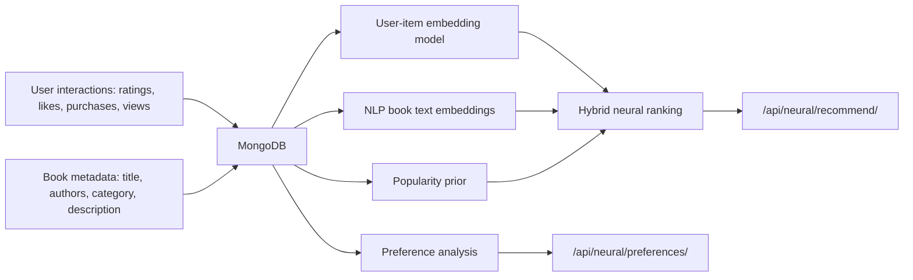

# Neural Network Project Extension: GoodBooks Recommender

## Project Fit

This project now fits topic 8, "Recommendation System", because it recommends books using a hybrid neural/NLP approach.

Course topics covered:
- Embeddings: users, books, and book text are represented as dense vectors.
- Deep learning: user-book affinity is learned through Neural Collaborative Filtering with a hidden layer.
- NLP: book title, author, category, and description are converted into text embeddings.

User-facing capabilities:
- Personal recommendations for each user.
- Preference analysis based on ratings, likes, purchases, and views.
- Explainable recommendation reasons.

## What Was Added

The original system already had a classic item-item collaborative filtering recommender in `backend/recommend.py`.

The new extension adds `backend/neural_recommend.py`, which trains a small Neural Collaborative Filtering model. It learns user embeddings and book embeddings, concatenates them, and passes them through a hidden layer to predict user-book affinity.

The final hybrid recommendation score is:

`final_score = 0.55 * user_item_embedding + 0.35 * nlp_content_embedding + 0.10 * popularity_prior`

For cold-start users, the system uses:

`cold_start_score = 0.75 * popularity_prior + 0.25 * content_embedding`

This makes the system more suitable for a neural networks course because it demonstrates learned latent vectors, a neural scoring layer, and NLP-based semantic matching.

## Neural Model Details

The neural part is not only a heuristic ranking formula. The model has a real trainable architecture:

```text
user_id -> user embedding
book_id -> book embedding
concat(user_embedding, book_embedding)
hidden layer with tanh activation
output affinity score
```

Training evidence stored in the model artifact:
- epochs;
- training loss curve;
- train RMSE and MAE;
- validation RMSE and MAE;
- ranking metrics: Precision@10, Recall@10, HitRate@10, NDCG@10;
- validation strategy.

The model card endpoint exposes this evidence in JSON format:

```text
GET /api/neural/model-card
```

## Architecture



## New API

- `GET /api/neural/recommend/<user_id>?limit=10`
  - Returns neural/NLP hybrid recommendations.
  - Each result includes `neural_score`, `reason`, and `score_components`.

- `GET /api/neural/preferences/<user_id>`
  - Returns top categories, authors, keywords, and signal count.
  - Protected by session authentication because it exposes personal preference signals.

- `GET /admin/rebuild-neural`
  - Rebuilds book text embeddings and user-item latent embeddings.

- `GET /api/neural/model-card`
  - Returns architecture, training settings, validation metrics, and course alignment.

## New Tests

Added tests in `tests/test_neural_recommend.py`:

- `test_build_book_text_embeddings_creates_vectors`
- `test_build_user_item_embedding_model_trains_latent_vectors`
- `test_neural_recommendations_rank_content_and_exclude_seen`
- `test_preference_analysis_returns_categories_authors_and_keywords`
- `test_cold_start_neural_recommendations_use_popularity`
- `test_model_card_exposes_architecture_training_and_alignment`

Added API tests in `tests/test_api.py`:

- `test_neural_recommend_endpoint_returns_payload`
- `test_neural_preferences_requires_authentication`
- `test_neural_preferences_rejects_other_user`
- `test_neural_preferences_returns_authenticated_profile`
- `test_neural_model_card_returns_training_metadata`

## How To Run

Run the focused tests:

```powershell
venv\Scripts\python.exe -m pytest tests\test_neural_recommend.py tests\test_api.py -q
```

Rebuild neural recommender artifacts:

```powershell
venv\Scripts\python.exe scripts\build_neural_recommender.py
```

Fast demo build with explicit limits:

```powershell
$env:NEURAL_EPOCHS="10"
$env:NEURAL_MAX_EVENTS="2000"
$env:NEURAL_BATCH_SIZE="2048"
venv\Scripts\python.exe scripts\build_neural_recommender.py
```

Or from the browser:

```text
http://localhost:5000/admin/rebuild-neural?epochs=10&max_events=2000&batch_size=2048
```

Expected behavior:
- the script first prints the selected database, epochs, and maximum number of training events;
- it builds `data/neural_book_embeddings.pkl`;
- it builds `data/neural_user_item_model.pkl`;
- it prints the model card, preference profile, and sample recommendations.

## Optional GPU Training

For full-scale training on an NVIDIA GPU, install PyTorch with CUDA support and run the GPU trainer:

```powershell
venv\Scripts\python.exe -m pip install torch --index-url https://download.pytorch.org/whl/cu128
$env:NEURAL_EPOCHS="10"
$env:NEURAL_MAX_EVENTS="500000"
$env:NEURAL_BATCH_SIZE="8192"
$env:NEURAL_HIDDEN_DIM="64"
$env:NEURAL_RANKING_USERS="1000"
$env:NEURAL_RANKING_NEGATIVES="99"
venv\Scripts\python.exe scripts\train_neural_recommender_torch.py
```

Expected GPU evidence:
- the script prints `PyTorch device: cuda`;
- it prints the GPU name;
- each epoch prints a training loss;
- the saved model card contains `model_type: neural_collaborative_filtering_pytorch`;
- the model card includes ranking metrics: Precision@10, Recall@10, HitRate@10, NDCG@10;
- the saved artifact is still compatible with the Flask recommendation API.

## Defense Summary

The main improvement is that recommendations are no longer only based on item-item similarity. The new version learns user and book embeddings from rating behavior and combines them with NLP embeddings from book metadata. This allows the system to recommend books that are semantically similar to a user's interests, even when exact collaborative data is limited.

The preference analysis endpoint makes the model more explainable: instead of only returning a ranked list, the system can show which categories, authors, and keywords influenced the recommendations.
